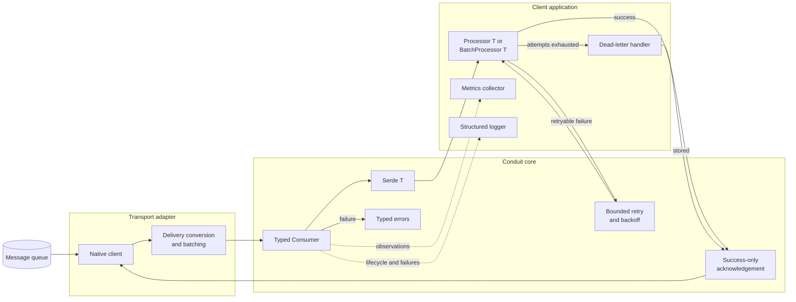

# Conduit architecture

Conduit separates application processing from queue-specific clients. The core
owns decoding, processor invocation, acknowledgement policy, metrics, logging,
and error classification. An adapter owns transport connections, subscription,
native batching, and conversion to `conduit.Delivery`.

## Message lifecycle

1. The adapter receives a native transport record.
2. It copies transport data into a `conduit.Delivery` and supplies an `Ack`
   callback. The adapter must not acknowledge the record itself.
3. The consumer deserializes the payload with `Serde[T]`.
4. It invokes `Processor[T]` for individual messages or `BatchProcessor[T]` for
   the complete batch.
5. A processor failure is retried according to the configured bounded retry
   policy. Backoff stops immediately when the run context is cancelled.
6. After attempts are exhausted, an optional dead-letter handler stores or
   republishes the failed delivery. Its success permits acknowledgement; its
   failure leaves the original delivery unacknowledged.
7. Only after successful processing or dead-letter handling does the consumer
   call the delivery's `Ack` callback.
8. Any terminal failure is returned as `*conduit.Error`, recorded by configured
   observability hooks, and left unacknowledged.

## Delivery semantics

Conduit provides **at-least-once processing** when used with an adapter that
redelivers uncommitted records. A process crash, rebalance, acknowledgement
failure, or later record failing in a sequential batch can cause a previously
processed record to be delivered again. Processors must therefore be
idempotent, normally by using a message identifier or business key.

Acknowledgement is intentionally separate from processing. This keeps the core
transport-neutral, but it also means an adapter must clearly document how its
`Ack` callback maps to native commits or acknowledgements.

## Extension points

| Extension | Responsibility |
| --- | --- |
| `Adapter` | Connect, subscribe, batch native records, and create deliveries |
| `Serde[T]` | Convert bytes to and from a client-owned type |
| `Processor[T]` | Process one decoded message |
| `BatchProcessor[T]` | Process a decoded batch atomically from the client's perspective |
| `Metrics` | Translate stable Conduit observations to any metrics backend |
| `Logger` | Translate structured lifecycle and failure events to any logging backend |
| `DeadLetterHandler` | Store or republish deliveries that exhaust processing attempts |

## Concurrency

Conduit does not impose global ordering or concurrency. Each adapter controls
the native consumption model. The Kafka adapter uses Sarama consumer-group
claims, so partitions can be processed concurrently while records within one
claim are processed in order. Metrics and logger implementations must be safe
for concurrent calls.

## Dependency direction

The core package has no dependency on Kafka, RabbitMQ, NATS, a logger, or a
metrics SDK. Each adapter package depends only on the core and its native client.
Applications depend on the core, the adapters they select, and their own
observability libraries. This direction keeps all transport implementations
independent of each other.
